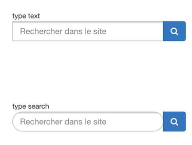

# Form

```less
.form-control {
//基本间距大小定位.
  display: block;
  width: 100%;
  height: @input-height-base; // Make inputs at least the height of their button counterpart (base line-height + padding + border)
  padding: @padding-base-vertical @padding-base-horizontal;
  font-size: @font-size-base;
  line-height: @line-height-base;
  color: @input-color;
  background-color: @input-bg;
  background-image: none; // Reset unusual Firefox-on-Android default style; see https://github.com/necolas/normalize.css/issues/214
//边框设定  
  border: 1px solid @input-border;
//小圆角  
  border-radius: @input-border-radius; // Note: This has no effect on <select>s in some browsers, due to the limited stylability of <select>s in CSS.
//阴影设定,所以控件都有陷下去的感觉.  
  .box-shadow(inset 0 1px 1px rgba(0,0,0,.075));
//过渡小效果.  
  .transition(~"border-color ease-in-out .15s, box-shadow ease-in-out .15s");

  // Customize the `:focus` state to imitate native WebKit styles.
 //设置focus时旁边蓝色的显示,实现方法在下方.
  .form-control-focus();

  // Placeholder
//提示文字的显示. 
  .placeholder();

  // Unstyle the caret on `<select>`s in IE10+.
  &::-ms-expand {
    border: 0;
    background-color: transparent;
  }

  // Disabled and read-only inputs
  //
  // HTML5 says that controls under a fieldset > legend:first-child won't be
  // disabled if the fieldset is disabled. Due to implementation difficulty, we
  // don't honor that edge case; we style them as disabled anyway.
//只读标签的灰色设置和小手改变  
  &[disabled],
  &[readonly],
  fieldset[disabled] & {
    background-color: @input-bg-disabled;
    opacity: 1; // iOS fix for unreadable disabled content; see https://github.com/twbs/bootstrap/issues/11655
  }

  &[disabled],
  fieldset[disabled] & {
    cursor: not-allowed;
  }

  // Reset height for `textarea`s
  textarea& {
    height: auto;
  }
}

.form-control-focus(@color: @input-border-focus) {
  @color-rgba: rgba(red(@color), green(@color), blue(@color), .6);
  &:focus {
    border-color: @color;
    outline: 0;
    .box-shadow(~"inset 0 1px 1px rgba(0,0,0,.075), 0 0 8px @{color-rgba}");
  }
}

.placeholder(@color: @input-color-placeholder) {
  // Firefox
  &::-moz-placeholder {
    color: #999; //灰色
    opacity: 1; // Override Firefox's unusual default opacity; see https://github.com/twbs/bootstrap/pull/11526
  }
  &:-ms-input-placeholder { color: @color; } // Internet Explorer 10+
  &::-webkit-input-placeholder  { color: @color; } // Safari and Chrome
}
```

以上是`form`表单的基本样式设定  

    input[type="search"] {
      -webkit-appearance: none;
    }



这里主要为了解决iOS的兼容问题,iOS会默认用油圆角的搜索框,要去掉.


```less
// Special styles for iOS temporal inputs
//
// In Mobile Safari, setting `display: block` on temporal inputs causes the
// text within the input to become vertically misaligned. As a workaround, we
// set a pixel line-height that matches the given height of the input, but only
// for Safari. See https://bugs.webkit.org/show_bug.cgi?id=139848
//
// Note that as of 8.3, iOS doesn't support `datetime` or `week`.

@media screen and (-webkit-min-device-pixel-ratio: 0) {
  input[type="date"],
  input[type="time"],
  input[type="datetime-local"],
  input[type="month"] {
    &.form-control {
      line-height: @input-height-base;
    }

    &.input-sm,
    .input-group-sm & {
      line-height: @input-height-small;
    }

    &.input-lg,
    .input-group-lg & {
      line-height: @input-height-large;
    }
  }
}
```
`iOS`设备当`display:block`的`input`文字会在框框里显示不出来. 