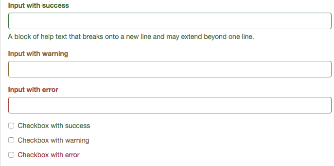

# Form

##1. 基本`Form设定

```less
.form-control {
//基本间距大小定位.
  display: block;
  width: 100%;
  height: @input-height-base; // Make inputs at least the height of their button counterpart (base line-height + padding + border)
  padding: @padding-base-vertical @padding-base-horizontal;
  font-size: @font-size-base;
  line-height: @line-height-base;
  color: @input-color;
  background-color: @input-bg;
  background-image: none; // Reset unusual Firefox-on-Android default style; see https://github.com/necolas/normalize.css/issues/214
//边框设定  
  border: 1px solid @input-border;
//小圆角  
  border-radius: @input-border-radius; // Note: This has no effect on <select>s in some browsers, due to the limited stylability of <select>s in CSS.
//阴影设定,所以控件都有陷下去的感觉.  
  .box-shadow(inset 0 1px 1px rgba(0,0,0,.075));
//过渡小效果.  
  .transition(~"border-color ease-in-out .15s, box-shadow ease-in-out .15s");

  // Customize the `:focus` state to imitate native WebKit styles.
 //设置focus时旁边蓝色的显示,实现方法在下方.
  .form-control-focus();

  // Placeholder
//提示文字的显示. 
  .placeholder();

  // Unstyle the caret on `<select>`s in IE10+.
  &::-ms-expand {
    border: 0;
    background-color: transparent;
  }

  // Disabled and read-only inputs
  //
  // HTML5 says that controls under a fieldset > legend:first-child won't be
  // disabled if the fieldset is disabled. Due to implementation difficulty, we
  // don't honor that edge case; we style them as disabled anyway.
//只读标签的灰色设置和小手改变  
  &[disabled],
  &[readonly],
  fieldset[disabled] & {
    background-color: @input-bg-disabled;
    opacity: 1; // iOS fix for unreadable disabled content; see https://github.com/twbs/bootstrap/issues/11655
  }

  &[disabled],
  fieldset[disabled] & {
    cursor: not-allowed;
  }

  // Reset height for `textarea`s
  textarea& {
    height: auto;
  }
}

.form-control-focus(@color: @input-border-focus) {
  @color-rgba: rgba(red(@color), green(@color), blue(@color), .6);
  &:focus {
    border-color: @color;
    outline: 0;
    .box-shadow(~"inset 0 1px 1px rgba(0,0,0,.075), 0 0 8px @{color-rgba}");
  }
}

.placeholder(@color: @input-color-placeholder) {
  // Firefox
  &::-moz-placeholder {
    color: #999; //灰色
    opacity: 1; // Override Firefox's unusual default opacity; see https://github.com/twbs/bootstrap/pull/11526
  }
  &:-ms-input-placeholder { color: @color; } // Internet Explorer 10+
  &::-webkit-input-placeholder  { color: @color; } // Safari and Chrome
}
```

以上是`form`表单的基本样式设定  

    input[type="search"] {
      -webkit-appearance: none;
    }


这里主要为了解决iOS的兼容问题,iOS会默认用油圆角的搜索框,要去掉.


```less
// Special styles for iOS temporal inputs
//
// In Mobile Safari, setting `display: block` on temporal inputs causes the
// text within the input to become vertically misaligned. As a workaround, we
// set a pixel line-height that matches the given height of the input, but only
// for Safari. See https://bugs.webkit.org/show_bug.cgi?id=139848
//
// Note that as of 8.3, iOS doesn't support `datetime` or `week`.

@media screen and (-webkit-min-device-pixel-ratio: 0) {
  input[type="date"],
  input[type="time"],
  input[type="datetime-local"],
  input[type="month"] {
    &.form-control {
      line-height: @input-height-base;
    }

    &.input-sm,
    .input-group-sm & {
      line-height: @input-height-small;
    }

    &.input-lg,
    .input-group-lg & {
      line-height: @input-height-large;
    }
  }
}
```
`iOS`时间选择器设定高度补充.

##2. `raduo` & `checkbox`

###2.1 基本样式


用法: 
```html
<div class="checkbox">
  <label>
    <input type="checkbox" value="">
    Option one is this and that&mdash;be sure to include why it's great
  </label>
</div>
```

```less
.radio,
.checkbox {
  position: relative;
  display: block;
  margin-top: 10px;
  margin-bottom: 10px;

  label {
    min-height: @line-height-computed; // Ensure the input doesn't jump when there is no text
    padding-left: 20px;
    margin-bottom: 0;
    font-weight: normal;
    cursor: pointer;
  }
}

```
在父层div中,定义相对定位和间距.

```less
.radio input[type="radio"],
.radio-inline input[type="radio"],
.checkbox input[type="checkbox"],
.checkbox-inline input[type="checkbox"] {
  position: absolute;
  margin-left: -20px;
  margin-top: 4px \9;
}

```
`margin-left:-20px`主要为了选框在最左方.
`\9`表示只给`IE`设置此样式参考http://www.cnblogs.com/dolphinX/p/3292630.html<>

###2.2 `.checkbox/radio-inline`


使用
```html
<label class="checkbox-inline">
  <input type="checkbox" id="inlineCheckbox1" value="option1"> 1
</label>
```
```less
.radio-inline,
.checkbox-inline {
  position: relative;
  display: inline-block;
  padding-left: 20px;
  margin-bottom: 0;
  vertical-align: middle;
  font-weight: normal;
  cursor: pointer;
}

.radio-inline + .radio-inline,
.checkbox-inline + .checkbox-inline {
  margin-top: 0;
  margin-left: 10px; // space out consecutive inline controls
}
```

和默认不同的是

1.  display: inline-block;
2.  `padding-left`直接给`label`
3.  兄弟节点值钱设定了间距.

##3 `.form-inline` & `.form-horizontal` 

###3.1 `.form-inline`


```less
.form-inline {

  // Kick in the inline
  @media (min-width: @screen-sm-min) {
    // Inline-block all the things for "inline"
    .form-group {
      display: inline-block;
      margin-bottom: 0;
      vertical-align: middle;
    }

    // In navbar-form, allow folks to *not* use `.form-group`
    .form-control {
      display: inline-block;
      width: auto; // Prevent labels from stacking above inputs in `.form-group`
      vertical-align: middle;
    }

    // Make static controls behave like regular ones
    .form-control-static {
      display: inline-block;
    }

    .input-group {
      display: inline-table;
      vertical-align: middle;

      .input-group-addon,
      .input-group-btn,
      .form-control {
        width: auto;
      }
    }

    // Input groups need that 100% width though
    .input-group > .form-control {
      width: 100%;
    }

    .control-label {
      margin-bottom: 0;
      vertical-align: middle;
    }

    // Remove default margin on radios/checkboxes that were used for stacking, and
    // then undo the floating of radios and checkboxes to match.
    .radio,
    .checkbox {
      display: inline-block;
      margin-top: 0;
      margin-bottom: 0;
      vertical-align: middle;

      label {
        padding-left: 0;
      }
    }
    .radio input[type="radio"],
    .checkbox input[type="checkbox"] {
      position: relative;
      margin-left: 0;
    }

    // Re-override the feedback icon.
    .has-feedback .form-control-feedback {
      top: 0;
    }
  }
}

```
这里只有当屏幕大于正常pc才会有效果.不然都是扯淡..

设置基本都是

1. display:inline-block
2. vertical-align:middle

###3.2 `form-horizontal`


```less
.form-horizontal {

  // Consistent vertical alignment of radios and checkboxes
  //
  // Labels also get some reset styles, but that is scoped to a media query below.
  .radio,
  .checkbox,
  .radio-inline,
  .checkbox-inline {
    margin-top: 0;
    margin-bottom: 0;
    padding-top: (@padding-base-vertical + 1); // Default padding plus a border
  }
  // Account for padding we're adding to ensure the alignment and of help text
  // and other content below items
  .radio,
  .checkbox {
    min-height: (@line-height-computed + (@padding-base-vertical + 1));
  }

  // Make form groups behave like rows
  .form-group {
    .make-row();
  }

  // Reset spacing and right align labels, but scope to media queries so that
  // labels on narrow viewports stack the same as a default form example.
  @media (min-width: @screen-sm-min) {
    .control-label {
      text-align: right;
      margin-bottom: 0;
      padding-top: (@padding-base-vertical + 1); // Default padding plus a border
    }
  }

  // Validation states
  //
  // Reposition the icon because it's now within a grid column and columns have
  // `position: relative;` on them. Also accounts for the grid gutter padding.
  .has-feedback .form-control-feedback {
    right: floor((@grid-gutter-width / 2));
  }

  // Form group sizes
  //
  // Quick utility class for applying `.input-lg` and `.input-sm` styles to the
  // inputs and labels within a `.form-group`.
  .form-group-lg {
    @media (min-width: @screen-sm-min) {
      .control-label {
        padding-top: (@padding-large-vertical + 1);
        font-size: @font-size-large;
      }
    }
  }
  .form-group-sm {
    @media (min-width: @screen-sm-min) {
      .control-label {
        padding-top: (@padding-small-vertical + 1);
        font-size: @font-size-small;
      }
    }
  }
}

```
##4 状态输入框



