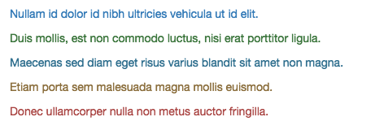
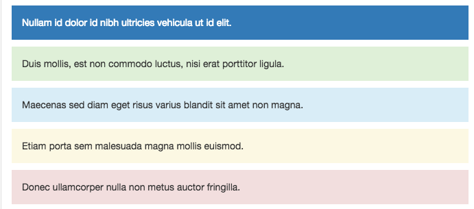

# Type

`type.less`主要设置了字体

##1. 字体

###1.1 标题

代码

    h1, h2, h3, h4, h5, h6,
    .h1, .h2, .h3, .h4, .h5, .h6 {
      font-family: @headings-font-family;
      font-weight: @headings-font-weight;
      line-height: @headings-line-height;
      color: @headings-color;
    
      small,
      .small {
        font-weight: normal;
        line-height: 1;
        color: @headings-small-color;
      }
    }
    
    h1, .h1,
    h2, .h2,
    h3, .h3 {
      margin-top: @line-height-computed;
      margin-bottom: (@line-height-computed / 2);
    
      small,
      .small {
        font-size: 65%;
      }
    }
    h4, .h4,
    h5, .h5,
    h6, .h6 {
      margin-top: (@line-height-computed / 2);
      margin-bottom: (@line-height-computed / 2);
    
      small,
      .small {
        font-size: 75%;
      }
    }
    
    h1, .h1 { font-size: @font-size-h1; }
    h2, .h2 { font-size: @font-size-h2; }
    h3, .h3 { font-size: @font-size-h3; }
    h4, .h4 { font-size: @font-size-h4; }
    h5, .h5 { font-size: @font-size-h5; }
    h6, .h6 { font-size: @font-size-h6; }

1. 设置了默认的字体,字体粗细,行高,粗细
2. `margin`和`small`在`h1~h3` & `h4~h6` 做了不同的配置

###1.2 内容字体

    p {
      margin: 0 0 (@line-height-computed / 2);
    }
    
    .lead {
      margin-bottom: @line-height-computed;
      font-size: floor((@font-size-base * 1.15));
      font-weight: 300;
      line-height: 1.4;
    
      @media (min-width: @screen-sm-min) {
        font-size: (@font-size-base * 1.5);
      }
    }
    
1. `p`标签设置了基本的`margin`和`h4~h6`的一致
2. `.read`主要味儿了提供阅读做了

    1. `margin-btoom`和`h1~h3`一致
    
    2. 增加了字体大小和粗细还有行间距

    3. 小分辨率下增加文字大小.
    
##1.3 辅助性文字

1. 普通`small`
    
        // Ex: (12px small font / 14px base font) * 100% = about 85%
        small,
        .small {
          font-size: floor((100% * @font-size-small / @font-size-base));
        }

    再看一下`@font-size-small`的设置

        @font-size-small: ceil((@font-size-base * 0.85)); // ~12px

    所以small一般为父元素的百分之85%~..

2. `mark`字体
        mark,
        .mark {
          background-color: @state-warning-bg;
          padding: .2em;
        }
    
    1. 设置了背景颜色
    2. 设置了padding为字体大小了0.2倍

3. 字体定位 & 大小写

        .text-left           { text-align: left; }
        .text-right          { text-align: right; }
        .text-center         { text-align: center; }
        .text-justify        { text-align: justify; }//两端对齐
        .text-nowrap         { white-space: nowrap; }
        
        // Transformation
        .text-lowercase      { text-transform: lowercase; }
        .text-uppercase      { text-transform: uppercase; }
        .text-capitalize     { text-transform: capitalize; }//首字母大写

4. 字体颜色

    

        .text-muted {
          color: @text-muted;
        }
        .text-primary {
          .text-emphasis-variant(@brand-primary);
        }
        .text-success {
          .text-emphasis-variant(@state-success-text);
        }
        .text-info {
          .text-emphasis-variant(@state-info-text);
        }
        .text-warning {
          .text-emphasis-variant(@state-warning-text);
        }
        .text-danger {
          .text-emphasis-variant(@state-danger-text);
        }
        
        .text-emphasis-variant(@color) {
          color: @color;
          a&:hover,
          a&:focus {
            color: darken(@color, 10%);
          }
        }

    1. 普通字体颜色配置
    2. `primary~danger`还设置了选中/焦点效果加亮.
    
      
5. 显著展示文字

    
    
        .bg-primary {
          // Given the contrast here, this is the only class to have its color inverted
          // automatically.
          color: #fff;
          .bg-variant(@brand-primary);
        }
        .bg-success {
          .bg-variant(@state-success-bg);
        }
        .bg-info {
          .bg-variant(@state-info-bg);
        }
        .bg-warning {
          .bg-variant(@state-warning-bg);
        }
        .bg-danger {
          .bg-variant(@state-danger-bg);
        }
        
        .bg-variant(@color) {
          background-color: @color;
          a&:hover,
          a&:focus {
            background-color: darken(@color, 10%);
          }
        }
    
    这里和字体颜色类似,只不过换成了背景颜色
    
    因为默认的`.bg-primart`为蓝色,故字体要换成白色,黑色不明显.   

##2. List

1. 有序 & 无序 列表

        ul,
        ol {
          margin-top: 0;
          margin-bottom: (@line-height-computed / 2);
          ul,
          ol {
            margin-bottom: 0;
          }
        }
            
    基本的间距设置
    
    清除基本列表图标
    
        .list-unstyled {
          padding-left: 0;
          list-style: none;
        }
2. 
   

    
    
    

